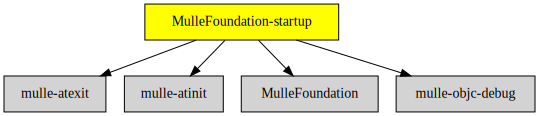

# MulleFoundation-startup

#### ▶️ Startup library for MulleFoundation

This static library provides the required `__register_mulle_objc_universe`
function for executables, that link against
[MulleFoundation](https://github.com/mulle-objc/MulleFoundation).


Build Status | Release Version
-------------|-----------------------------------
[](https://travis-ci.org/MulleFoundation/MulleFoundation-startup) |  [](https://travis-ci.org/MulleFoundation/MulleFoundation-startup)


## Sourcetree

The main raison d'être of MulleFoundation-startup as a
separate library is to bequeath the required dependencies
[mulle-atinit](//github.com/mulle-core/mulle-atinit) and
[mulle-atexit](//github.com/mulle-core/mulle-atexit) for linking the
executable.


### You are here




## Install

See [mulle-foundation-developer](//github.com/MulleFoundation/mulle-foundation-developer) for
installation instructions.


## Build

This is a [mulle-sde]/(//github.com/mulle-sde) project which will
fetch all dependencies and build with `mulle-sde craft`.

### Manually with cmake

Install all prerequisites (use mulle-sde to figure them out) then:

```
(
   mkdir build &&
   cd build &&
   cmake .. &&
   make
)
```


### Legacy install

```
mulle-sde install --prefix "/usr/local" \
                  "https://github.com/MulleFoundation/Foundation-startup/archive/latest.tar.gz"
```

#### Legacy install prerelease

For testing before release:

```
source `curl -L https://raw.githubusercontent.com/MulleFoundation/Foundation/prerelease/.mulle/etc/env/environment-host-travis-ci-prerelease.sh`
mulle-sde install --branch prerelease \
                  --prefix "/tmp/usr" \
                  "https://github.com/MulleFoundation/Foundation-startup.git"
```


### Platforms and Compilers

All platforms and compilers supported by
[mulle-c11](//github.com/mulle-c/mulle-c11/) and
[mulle-thread](//github.com/mulle-concurrent/mulle-thread/).


## Author

[Nat!](//www.mulle-kybernetik.com/weblog) for
[Mulle kybernetiK](//www.mulle-kybernetik.com) and
[Codeon GmbH](//www.codeon.de)
